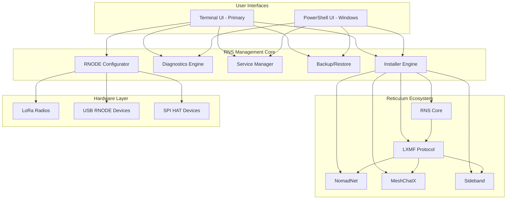

# RNS Management Tool - Development Guide

**Complete Reticulum Network Stack Management Solution** - A comprehensive, cross-platform management tool for the Reticulum ecosystem, featuring automated installation, configuration, and maintenance capabilities.

## Project Overview

RNS Management Tool transforms any Raspberry Pi or Linux/Windows machine into a complete Reticulum network management station. The tool bridges the gap between complex network stack configuration and user-friendly operation.

**Key Tagline:** "Complete Reticulum Ecosystem Management - One Tool, All Platforms"

**Version:** 0.4.0-beta | **License:** GPLv3 | **Languages:** Bash 65%, PowerShell 30%, Markdown 5%

---

## Development Philosophy

The project follows a pragmatic tiered priority system:

1. **Make it work** - Establish functional capability first
2. **Make it reliable** - Strengthen error handling and security
3. **Make it maintainable** - Code clarity and documentation
4. **Make it fast** - Optimize only when justified by evidence

---

## Architecture Overview


```mermaid
graph TB
    subgraph "User Interfaces"
        TUI[Terminal UI - Primary]
        PS[PowerShell UI - Windows]
    end

    subgraph "RNS Management Core"
        INST[Installer Engine]
        DIAG[Diagnostics Engine]
        SVC[Service Manager]
        BACKUP[Backup/Restore]
        RNODE[RNODE Configurator]
    end

    subgraph "Reticulum Ecosystem"
        RNS[RNS Core]
        LXMF[LXMF Protocol]
        NOMAD[NomadNet]
        MESH[MeshChatX]
        SIDE[Sideband]
    end

    subgraph "Hardware Layer"
        LORA[LoRa Radios]
        USB[USB RNODE Devices]
        SPI[SPI HAT Devices]
    end

    TUI --> INST & DIAG & SVC & BACKUP & RNODE
    PS --> INST & DIAG & SVC & BACKUP

    INST --> RNS & LXMF & NOMAD & MESH & SIDE
    RNODE --> LORA & USB & SPI
    RNS --> LXMF --> NOMAD & MESH & SIDE
```

---

## Directory Structure

```
/home/user/RNS-Management-Tool/
├── rns_management_tool.sh          # Main dispatcher (326 lines)
├── rns_management_tool.ps1         # Windows PowerShell dispatcher (144 lines)
│
├── lib/                            # Bash modules (11 files, ~4,850 lines)
│   ├── core.sh                     # Terminal detection, colors, home resolution, globals
│   ├── validation.sh               # Centralized input validation (RNS002-RNS004)
│   ├── utils.sh                    # Timeout, retry, logging, caching, service checks
│   ├── ui.sh                       # Print functions, box drawing, menus, help
│   ├── install.sh                  # Prerequisites, ecosystem, MeshChatX, Sideband
│   ├── rnode.sh                    # RNODE device configuration and management
│   ├── services.sh                 # Service management, meshtasticd, autostart
│   ├── backup.sh                   # Backup/restore, export/import
│   ├── diagnostics.sh              # 8-step diagnostics (incl. RNS environment doctor), return-value pattern
│   ├── config.sh                   # Config templates, editor, viewer, logs
│   └── advanced.sh                 # Emergency mode, advanced menu, startup
│
├── pwsh/                           # PowerShell modules (9 files, ~2,562 lines)
│   ├── core.ps1                    # Environment, logging, health checks, log rotation
│   ├── ui.ps1                      # Color output, headers, menus, quick status
│   ├── environment.ps1             # WSL, Python, pip detection
│   ├── install.ps1                 # Python, Reticulum, MeshChatX, Sideband, ecosystem
│   ├── rnode.ps1                   # Serial port, radio config, EEPROM, bootloader
│   ├── services.ps1                # Daemon control, network tools, identity, autostart
│   ├── backup.ps1                  # Backup/restore, export/import, list/delete
│   ├── diagnostics.ps1             # 7-step diagnostic checks (incl. RNS environment doctor)
│   └── advanced.ps1                # Cache, factory reset, updates, config management
│
├── config_templates/               # Pre-built RNS configurations
│   ├── minimal.conf                # Local network only (AutoInterface)
│   ├── lora_rnode.conf             # RNODE radio + LAN
│   ├── tcp_client.conf             # Internet connectivity via community nodes
│   └── transport_node.conf         # Full routing node
│
├── tests/                          # Test suites (~5,200 lines)
│   ├── smoke_test.sh               # 183 assertions across 8 sections
│   ├── rns_management_tool.bats    # 63 BATS tests
│   ├── hardware_validation.bats    # 92 BATS tests (RNODE hardware safety)
│   ├── integration_tests.bats      # 145 BATS tests (service, backup, platform, behavioral)
│   ├── regression_guards.bats      # 76 BATS tests (architectural invariant prevention)
│   ├── functional_tests.bats       # 59 BATS tests (functional behavior)
│   ├── service_health_tests.bats   # 24 BATS tests (granular health states)
│   ├── diagnostics_enhanced.bats   # 14 BATS tests (enhanced diagnostics)
│   ├── run_bats_compat.sh          # Lightweight BATS-compatible test runner
│   ├── rnode.tests.ps1             # 57 Pester tests
│   ├── services.tests.ps1          # 61 Pester tests
│   ├── backup.tests.ps1            # 48 Pester tests
│   └── *.tests.ps1                 # 7 more Pester suites (343 total across 9 files)
│
├── scripts/                        # Development and verification scripts
│   ├── lint.sh                     # Custom linter (RNS001-RNS010)
│   ├── dead_code_check.sh          # Dead code detection (development tool)
│   └── verify_install.sh           # Post-install verification (colored/quiet/JSON)
│
├── .githooks/                      # Git hooks (setup: git config core.hooksPath .githooks)
│   └── pre-commit                  # 5-stage checks: syntax, linter, private-key detection, large-file check, ShellCheck
│
├── .github/workflows/lint.yml      # CI: shellcheck, custom-lint, check-mode, smoke-test, bats, powershell, pester
│
├── README.md                       # Primary project documentation
├── CLAUDE.md                       # THIS FILE - Development guide
├── QUICKSTART.md                   # 5-minute setup guide
├── CHANGELOG.md                    # Version history (semantic versioning)
├── SECURITY.md                     # Security policy + vuln reporting + RNS001–RNS011 audit table
├── SESSION_NOTES.md                # Development session history
├── SECURITY_REVIEW.md              # Security & code review (Session 13)
└── PERSISTENT_ISSUES.md            # Recurring issues & resolution patterns
```

---

## Security Rules (Adapted from MeshForge)

The project enforces strict security practices:

| Rule | Requirement | Enforcement |
|------|-------------|-------------|
| RNS001 | Array-based command execution, never `eval` | Code review |
| RNS002 | Input validation for all device ports | Regex validation |
| RNS003 | Numeric range validation for radio parameters | Bounds checking |
| RNS004 | Path traversal prevention in import/export | Path validation |
| RNS005 | Confirmation for destructive actions | UI prompts |
| RNS006 | Subprocess timeout protection | Timeout wrappers |
| RNS007 | No hardcoded `/tmp` paths (use `mktemp`/`${TMPDIR:-/tmp}`) | Linter (RNS009) |
| RNS008 | Config templates must have `[reticulum]` section | Linter |
| RNS009 | Temp files must use `mktemp` | Linter (`scripts/lint.sh`) |
| RNS010 | No sensitive data in log output | Linter (`scripts/lint.sh`) |
| RNS011 | No hardcoded `/home/<user>/` paths (use `$HOME` / `$REAL_HOME` / `~`) | Linter (`scripts/lint.sh`) |

### Security Examples

```bash
# CORRECT: Array-based command execution
declare -a CMD_ARGS=("$DEVICE_PORT")
CMD_ARGS+=("--freq" "$FREQ")
rnodeconf "${CMD_ARGS[@]}"

# WRONG: String interpolation (command injection risk)
eval "rnodeconf $DEVICE_PORT --freq $FREQ"  # NEVER DO THIS

# CORRECT: Device port validation
if [[ ! "$DEVICE_PORT" =~ ^/dev/tty[A-Za-z0-9]+$ ]]; then
    print_error "Invalid device port format"
    return 1
fi

# CORRECT: Numeric validation with range
if [[ "$SF" =~ ^[0-9]+$ ]] && [ "$SF" -ge 7 ] && [ "$SF" -le 12 ]; then
    CMD_ARGS+=("--sf" "$SF")
fi

# CORRECT: Atomic write for any config/identity file
# Use write_atomic() (lib/utils.sh) — never `cmd > /path/to/config`. The helper
# preserves file mode and survives crashes/power-loss via mktemp+rename.
write_atomic "$REAL_HOME/.reticulum/config" "$rendered_config"
```

---

## UI Design Principles

### Raspi-Config Style Terminal UI

1. **TUI as Dispatcher** - Terminal UI selects what to run, not how
2. **Clear Visual Hierarchy** - Box drawing, colors, and sections
3. **Status at a Glance** - Compact status line in every header
4. **Breadcrumb Navigation** - Always know where you are
5. **Graceful Degradation** - Missing features disable, don't crash

### Color Scheme

```bash
GREEN   = Success/Running   [✓] or ●
YELLOW  = Warning/Stopped   [!] or ○
RED     = Error/Failed      [✗]
CYAN    = Information       [i]
BLUE    = Section headers   ▶
MAGENTA = Emphasis          (sparingly)
```

### Menu Structure

```
Main Menu
├── Installation ───────────────────
│   ├── 1) Install/Update Reticulum Ecosystem
│   ├── 2) Install/Configure RNODE Device
│   ├── 3) Install NomadNet
│   ├── 4) Install MeshChatX
│   └── 5) Install Sideband
│
├── Management ─────────────────────
│   ├── 6) System Status & Diagnostics
│   ├── 7) Manage Services
│   │   ├── Daemon Control (start/stop/restart/status)
│   │   ├── Network Tools (rnstatus/rnpath/rnprobe/rncp/rnx)
│   │   └── Identity & Boot (rnid/autostart)
│   ├── 8) Backup/Restore Configuration
│   └── 9) Advanced Options
│       ├── Configuration (view/edit/templates/deployment profiles)
│       └── Maintenance (packages/reinstall/cache/logs/reset)
│
└── Quick & Help ──────────────────
    ├── q) Quick Mode (field operations)
    ├── h) Help & Quick Reference
    └── 0) Exit
```

---

## Development Standards

### Code Organization

1. **Functions should be < 200 lines** - Break long functions into helpers
2. **Single responsibility** - Each function does one thing well
3. **Consistent naming** - `print_*`, `show_*`, `check_*`, `install_*`
4. **Error handling first** - Validate inputs before processing

### Testing Requirements

```bash
# Syntax validation
bash -n rns_management_tool.sh
for f in lib/*.sh; do bash -n "$f"; done

# ShellCheck linting (zero warnings required)
shellcheck -x -S warning rns_management_tool.sh
for f in lib/*.sh; do shellcheck -x -S warning "$f"; done

# Test suites
./tests/smoke_test.sh --verbose
bats tests/rns_management_tool.bats
bats tests/hardware_validation.bats
bats tests/integration_tests.bats
bats tests/regression_guards.bats

# CI dry-run
./rns_management_tool.sh --check

# Post-install verification
./scripts/verify_install.sh          # Colored output
./scripts/verify_install.sh --json   # Machine-readable

# PowerShell syntax check
pwsh -NoProfile -Command "& { Get-Content rns_management_tool.ps1 | Out-Null }"

# Pre-commit hook setup (enforces linter + syntax on every commit)
git config core.hooksPath .githooks
```

### Commit Message Format

```
<type>(<scope>): <description>

Types: feat, fix, docs, style, refactor, test, chore
Scope: bash, powershell, docs, rnode, service, backup

Examples:
feat(bash): add factory reset with safety backup
fix(rnode): validate device port format before execution
docs: update CLAUDE.md with security rules
```

---

## Known Issues & Workarounds

See [PERSISTENT_ISSUES.md](PERSISTENT_ISSUES.md) for detailed root causes, fixes, and regression guards.

| Issue | Platform | Status |
|-------|----------|--------|
| RNODE not detected | Linux | `sudo usermod -aG dialout $USER` then logout/login |
| rnsd won't start | All | Check `~/.reticulum/config` exists |
| MeshChatX install fails | All | Needs Python 3.11+; `pip install reticulum-meshchatx` (no Node.js) |
| Permission denied | Linux | `chmod +x rns_management_tool.sh` |
| pip externally-managed error | Debian 12+ | Script auto-adds `--break-system-packages` flag |

---

## Core Tools Integration

| Tool | Purpose | Integration Level |
|------|---------|-------------------|
| `rnsd` | Reticulum daemon | Full (start/stop/status/uptime) |
| `rnstatus` | Network status | Full (diagnostics + services menu) |
| `rnpath` | Path table | Full (services menu) |
| `rnprobe` | Destination probe | Full (services menu) |
| `rncp` | File transfer | Full (services menu) |
| `rnx` | Remote command | Full (services menu) |
| `rnid` | Identity management | Full (services menu) |
| `rnodeconf` | RNODE configuration | Full (21+ device support) |

---

## Code Review Checklist

### Security
- [ ] No `eval` usage
- [ ] Input validation for all user inputs
- [ ] Device port regex validation
- [ ] Numeric bounds checking
- [ ] Path traversal prevention
- [ ] No hardcoded credentials

### Quality
- [ ] Functions under 200 lines
- [ ] Single responsibility per function
- [ ] Consistent error handling
- [ ] Logging for all operations
- [ ] User feedback (progress, status)
- [ ] Graceful degradation for missing deps

### UI/UX
- [ ] Clear menu hierarchy
- [ ] Consistent color usage
- [ ] Status indicators visible
- [ ] Help available (h or ?)
- [ ] Confirmation for destructive actions

---

## Contributing

### Development Setup

```bash
git clone https://github.com/Nursedude/RNS-Management-Tool.git
cd RNS-Management-Tool

bash -n rns_management_tool.sh
shellcheck -x -S warning rns_management_tool.sh
./rns_management_tool.sh --check
```

### Pull Request Process

1. Fork the repository
2. Create feature branch: `git checkout -b feat/my-feature`
3. Run syntax and security checks
4. Update documentation if needed
5. Submit PR with clear description

---

## Resources

| Resource | URL |
|----------|-----|
| Reticulum Manual | reticulum.network/manual |
| RNS GitHub | github.com/markqvist/Reticulum |
| RNODE Firmware | github.com/markqvist/RNode_Firmware |
| MeshChatX | github.com/Quad4-Software/MeshChatX |
| Sideband | unsigned.io/sideband |
| MeshForge | github.com/Nursedude/meshforge |

---

## Project Metrics

Rough order of magnitude — regenerate exact counts with `scripts/metrics.sh` when precision matters.

- **Bash:** main dispatcher + 11 `lib/` modules (~6,400 lines total)
- **PowerShell:** main dispatcher + 9 `pwsh/` modules (~2,800 lines total)
- **Tests:** ~6,000 lines across 18 test files (~1,000 assertions)
- **Functions:** 130+ across all bash modules
- **Scripts:** `lint.sh` (RNS001-RNS010), `dead_code_check.sh`, `verify_install.sh`, `metrics.sh`, pre-commit hook
- **Markdown:** 8 documentation files (including SECURITY.md, SECURITY_REVIEW.md, PERSISTENT_ISSUES.md)
- **Security Rating:** A (formal review 2026-02-21 — see SECURITY_REVIEW.md)
- **CI Jobs:** 7 (shellcheck, custom-lint, check-mode, smoke-test, bats, powershell, pester)

---

**Maintainer:** Nursedude
**Repository:** github.com/Nursedude/RNS-Management-Tool

*Made with care for the Reticulum community*
