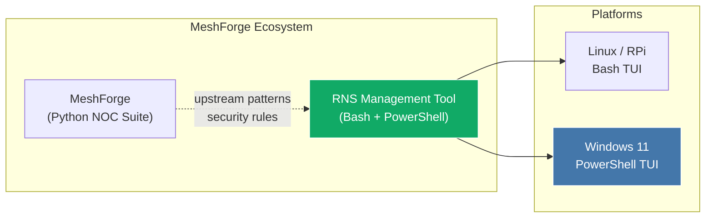
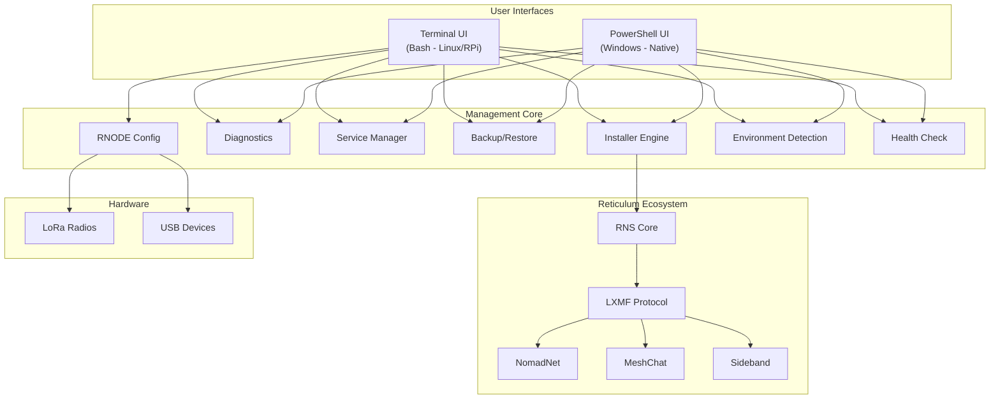
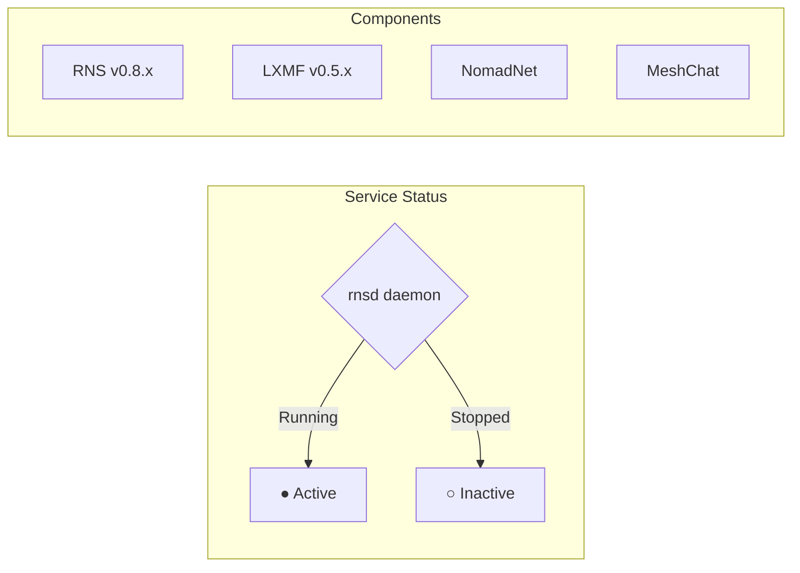
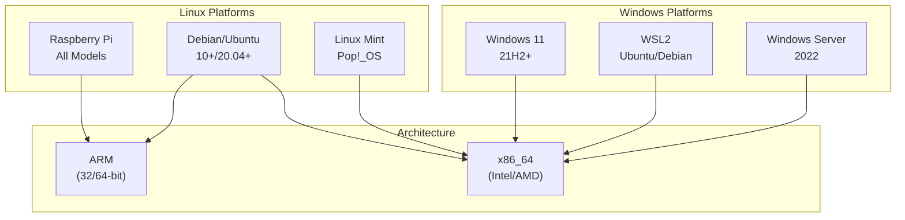
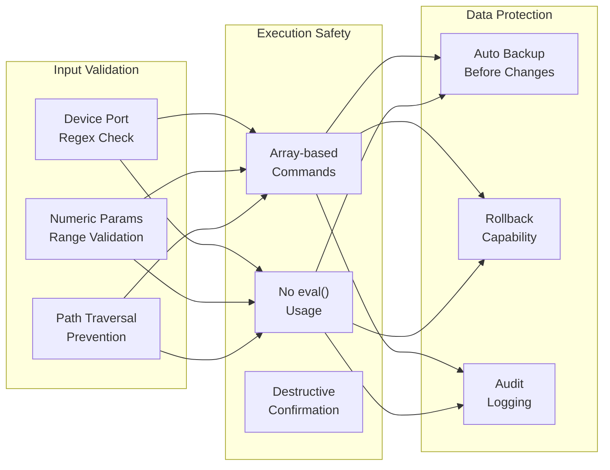

# RNS Management Tool

**Complete Reticulum Network Stack Management Solution**
*Part of the [MeshForge](https://github.com/Nursedude/meshforge) Ecosystem*

> [RNS installer](https://github.com/Nursedude/meshforge/blob/main/.claude/foundations/meshforge_ecosystem.md) for the [MeshForge ecosystem](https://github.com/Nursedude/meshforge/blob/main/.claude/foundations/meshforge_ecosystem.md)

A comprehensive, cross-platform management tool for the Reticulum ecosystem, featuring automated installation, configuration, and maintenance capabilities for Raspberry Pi, Linux, Windows 11, and WSL environments.

This is the **only MeshForge ecosystem tool with native Windows support**. Users don't need MeshForge installed to use this tool, but if they do, they can extend its functionality through MeshForge's gateway. Upstream MeshForge updates are frequent - environment patterns, security rules, and best practices flow downstream into this tool regularly.


> **Beta Software - Community Testing Needed**
>
> This tool is functional and actively developed, but has not been comprehensively field-tested across all supported platforms and hardware. If you use this tool, **please report issues and contribute improvements**. Your real-world testing on Raspberry Pi, desktop Linux, Windows, and with RNODE hardware is invaluable.
>
> Report issues: [GitHub Issues](https://github.com/Nursedude/RNS-Management-Tool/issues) | Contribute: [Pull Requests](https://github.com/Nursedude/RNS-Management-Tool/pulls)

---

## MeshForge Ecosystem



**Relationship to MeshForge:**
- MeshForge is the Python-based NOC reference suite for LoRa mesh networks
- RNS Management Tool extends the ecosystem with a shell-based TUI for Reticulum
- Security rules (RNS001-RNS006), environment patterns, and architectural decisions flow from MeshForge upstream
- This tool is standalone - no MeshForge installation required
- If MeshForge is installed, this tool can extend its functionality through MeshForge's gateway

---

## Architecture Overview



---

## Feature Matrix

Features are fully implemented unless marked otherwise. Platform differences are noted honestly.

| Category | Feature | Linux/RPi (Bash) | Windows (PowerShell) | Notes |
|----------|---------|:---:|:---:|-------|
| **Installation** | Full ecosystem install | ✅ | ✅ | |
| | Selective component updates | ✅ | ✅ | |
| | MeshChat with Node.js | ✅ | ❌ | Linux only (Node.js build) |
| **RNODE** | Auto-install firmware | ✅ | ⚠️ Basic | Windows: pip-only or WSL fallback |
| | Radio parameter config | ✅ | ❌ | Bash only (rnodeconf TUI) |
| | EEPROM management | ✅ | ❌ | Bash only |
| | 21+ board support | ✅ | ⚠️ via WSL | Full support through WSL bridge |
| **Services** | Start/Stop/Restart rnsd | ✅ | ✅ | |
| | systemd user services | ✅ | ❌ | Linux only |
| | meshtasticd integration | ✅ | ❌ | RPi/Linux only |
| **Backup** | Automatic timestamped | ✅ | ✅ | |
| | Export/Import archives | ✅ (.tar.gz) | ✅ (.zip) | Platform-native formats |
| | Factory reset | ✅ | ✅ | |
| **Diagnostics** | Environment detection | ✅ | ✅ | |
| | USB device detection | ✅ | ⚠️ | Windows: COM port detection |
| | Startup health check | ✅ | ✅ | Disk, memory, log validation |
| **Environment** | Terminal capability detection | ✅ | ✅ | Color fallback on dumb terminals |
| | Sudo-aware home directory | ✅ | N/A | Windows has no sudo issue |
| | SSH/remote session detection | ✅ | ✅ | SSH + RDP detection on Windows |
| | PEP 668 detection | ✅ | N/A | Debian 12+ externally-managed Python |
| | Disk space pre-check | ✅ | ✅ | |
| | Memory pre-check | ✅ | ✅ | |
| | Log levels (DEBUG-ERROR) | ✅ | ✅ | |
| | Signal trap / cleanup | ✅ | N/A | Bash EXIT/INT/TERM traps |
| **UI** | Quick Status Dashboard | ✅ | ✅ | |
| | Progress indicators | ✅ | ✅ | |
| | Box drawing / color | ✅ | ✅ | |

### Raspberry Pi vs Desktop Linux vs Windows

| Aspect | Raspberry Pi | Desktop Linux | Windows 11 |
|--------|:---:|:---:|:---:|
| Primary script | `rns_management_tool.sh` | `rns_management_tool.sh` | `rns_management_tool.ps1` |
| RNODE USB support | Full (native) | Full (native) | Via WSL or pip |
| LoRa SPI HAT support | Full | N/A | N/A |
| Pi model detection | Auto-detected | N/A | N/A |
| PEP 668 handling | Auto (Bookworm) | Depends on distro | N/A |
| Service management | systemd + direct | systemd + direct | Process-based |
| MeshChat | Full | Full | Not supported |
| WSL bridge | N/A | N/A | Full |
| Sideband | From source | From source | Executable download |

---

## Quick Status Dashboard



---

## Features

### Core Functionality
- **Cross-Platform Support** - Works on Raspberry Pi, Linux, Windows 11, and WSL2
- **Interactive Menu System** - Easy-to-use TUI with visual feedback
- **Environment Detection** - Terminal capabilities, SSH sessions, admin rights, PEP 668, disk/memory
- **Startup Health Check** - Validates environment before entering main menu
- **Smart Dependency Management** - Installs packages in the correct order
- **Comprehensive Backup System** - Automatic configuration backups with restore
- **Service Management** - Start, stop, and monitor Reticulum services
- **Leveled Logging** - DEBUG/INFO/WARN/ERROR with file rotation
- **Error Recovery** - Smart error handling with recovery suggestions
- **Signal Handling** - Clean exit on interrupt (Bash), cleanup on termination

### Reticulum Ecosystem
- **RNS (Reticulum Network Stack)** - Core cryptographic networking
- **LXMF** - Lightweight Extensible Message Format protocol
- **NomadNet** - Terminal-based messaging and file sharing
- **MeshChat** - Modern web-based messaging interface (Linux/RPi only)
- **Sideband** - Mobile-first LXMF client
- **RNODE** - Complete RNODE device setup and configuration

### RNODE Support
- **Interactive RNODE Installer** - Automated firmware flashing
- **Device Configuration Wizard** - Step-by-step setup for all supported devices
- **Auto-Install Mode** - Automatic device detection and flashing
- **Firmware Updates** - Keep your RNODE devices up to date
- **Device Testing** - Verify RNODE functionality
- **Support for 21+ Boards** - LilyGO T-Beam, Heltec LoRa32, RAK4631, and more

### Environment Hardening (from MeshForge)
These patterns are ported from the upstream MeshForge project:

| Pattern | Description | Bash | PowerShell |
|---------|-------------|:---:|:---:|
| Terminal capability detection | Graceful color fallback for dumb terminals and piped output | ✅ | ✅ |
| `SCRIPT_DIR` / `$Script:ScriptDir` | Reliable script directory resolution | ✅ | ✅ |
| `REAL_HOME` / `$Script:RealHome` | Sudo-aware home directory (prevents `/root` under sudo) | ✅ | N/A |
| SSH / remote session detection | Conservative behavior in remote sessions | ✅ | ✅ |
| PEP 668 detection | Identifies externally-managed Python (Debian 12+) | ✅ | N/A |
| Disk space pre-check | Validates available space before installs | ✅ | ✅ |
| Memory pre-check | Warns on low available memory | ✅ | ✅ |
| Git `safe.directory` guard | Prevents dubious ownership errors as root | ✅ | N/A |
| Signal trap / cleanup | Handles EXIT/INT/TERM for clean shutdown | ✅ | N/A |
| Log levels | DEBUG/INFO/WARN/ERROR with configurable filtering | ✅ | ✅ |
| Startup health check | Full environment validation before menu entry | ✅ | ✅ |
| Path traversal prevention | SUDO_USER sanitization, archive validation | ✅ | ✅ |

---

## Requirements

### Raspberry Pi / Linux
- Raspberry Pi OS (any version) or Debian/Ubuntu-based system
- Python 3.7 or higher
- 512MB+ RAM recommended
- 500MB+ free disk space (checked at startup)
- Internet connection (for installation)

### Windows 11
- Windows 11 (version 21H2 or higher)
- PowerShell 5.1+ or PowerShell Core 7+
- Python 3.7+ (will offer to install if missing)
- Administrator rights (recommended)
- 500MB+ free disk space (checked at startup)

### Optional
- Node.js 18+ (for MeshChat - Linux/RPi only)
- Git (for source installations)
- USB port (for RNODE devices)
- WSL2 (for full RNODE support on Windows)

## Quick Start

### Linux / Raspberry Pi

```bash
# Download the installer
wget https://raw.githubusercontent.com/Nursedude/RNS-Management-Tool/main/rns_management_tool.sh

# Make it executable
chmod +x rns_management_tool.sh

# Run the tool
./rns_management_tool.sh
```

### Windows 11

```powershell
# Download the installer (PowerShell)
Invoke-WebRequest -Uri "https://raw.githubusercontent.com/Nursedude/RNS-Management-Tool/main/rns_management_tool.ps1" -OutFile "rns_management_tool.ps1"

# Run the tool (you may need to allow script execution)
Set-ExecutionPolicy -Scope Process -ExecutionPolicy Bypass
.\rns_management_tool.ps1
```

### Windows Subsystem for Linux (WSL)

The Windows version includes WSL support! You can:
1. Install directly in Windows (native)
2. Install through WSL (recommended for RNODE devices)
3. Manage both simultaneously

---

## Usage Guide

### Main Menu Options

1. **Install/Update Reticulum Ecosystem** - Complete stack installation
2. **Install/Configure RNODE Device** - Interactive RNODE setup
3. **Install NomadNet** - Terminal messaging client
4. **Install MeshChat** - Web-based messaging interface (Linux/RPi)
5. **Install Sideband** - Mobile-focused client
6. **System Status & Diagnostics** - Check installation health
7. **Manage Services** - Start/stop/restart services
8. **Backup/Restore Configuration** - Protect your setup
9. **Advanced Options** - System updates, logs, and more

### RNODE Configuration Options

When you select "Install/Configure RNODE Device", you'll see:

1. **Auto-install firmware** (Easiest - Recommended)
   - Automatically detects and flashes your device
   - No manual configuration needed
   - Works with all supported boards

2. **List supported devices**
   - View all 21+ supported boards
   - Check compatibility before purchase

3. **Flash specific device**
   - Manual device selection
   - Custom port configuration

4. **Update existing RNODE**
   - Keep firmware up to date
   - Preserve configuration

5. **Test RNODE connection**
   - Verify device functionality
   - Check signal strength

6. **Advanced configuration**
   - EEPROM management
   - Bootloader updates
   - Custom parameters

### First-Time Setup


**For a complete Reticulum installation:**

1. Run the management tool
2. The startup health check validates your environment automatically
3. Select option **1** (Install/Update Reticulum Ecosystem)
4. The tool will:
   - Check prerequisites
   - Install Python dependencies if needed
   - Create a backup of existing configurations
   - Install RNS, LXMF, and optionally NomadNet
   - Start the rnsd daemon
   - Show installation status

**For RNODE setup:**

1. Connect your RNODE device via USB
2. Run the management tool
3. Select option **2** (Install/Configure RNODE Device)
4. Choose option **1** (Auto-install firmware)
5. The tool will automatically detect and configure your device

---

## Advanced Features

### Automatic Backup System

The tool automatically creates timestamped backups before any major operation:

```
~/.reticulum_backup_20251229_143052/
├── .reticulum/
│   ├── config
│   ├── identity
│   └── storage/
├── .nomadnetwork/
│   └── config
└── .lxmf/
    └── config
```

### Service Management

Control Reticulum services with ease:

```bash
# The tool handles these operations through the menu
- Start rnsd daemon
- Stop all services safely
- Monitor service status
- Restart after updates
```

### Logging

All operations are logged with levels (DEBUG/INFO/WARN/ERROR) to timestamped files:

```
~/rns_management_YYYYMMDD_HHMMSS.log
```

View logs through the Advanced Options menu.

### Environment Detection

The tool automatically detects and adapts to:
- **Raspberry Pi** model (all variants: Pi 1-5, Zero, 400, Compute Modules)
- **Operating system** and version
- **Architecture** (ARM, x86_64)
- **WSL environment** (Windows)
- **SSH / remote sessions** (conservative behavior)
- **Terminal capabilities** (color support, dumb terminal fallback)
- **PEP 668** externally-managed Python (Debian 12+ / RPi OS Bookworm)
- **Available disk space** and **memory** (warns before running low)
- **Python and pip** versions
- **Existing installations** and running services

---

## System Status & Diagnostics

The diagnostic tool provides:

- **Environment Information** - OS, architecture, platform details
- **Python Environment** - Version, path, packages
- **Network Interfaces** - Active connections
- **USB Devices** - Detect connected RNODEs
- **Reticulum Configuration** - Config file status
- **Service Status** - Running daemons and processes
- **Version Information** - All installed components
- **Health Status** - Disk space, memory, log writability

---

## Supported Platforms



### Raspberry Pi
- Raspberry Pi 1 (all variants)
- Raspberry Pi 2 (all variants)
- Raspberry Pi 3 (all variants)
- Raspberry Pi 4 (all variants)
- Raspberry Pi 5
- Raspberry Pi Zero (all variants)
- Raspberry Pi 400
- Raspberry Pi Compute Modules

### Linux Distributions
- Raspberry Pi OS (32-bit and 64-bit)
- Ubuntu 20.04+
- Debian 10+
- Linux Mint
- Pop!_OS
- Any Debian-based distribution

### Windows
- Windows 11 (21H2+)
- Windows 11 with WSL2
- Windows Server 2022

### RNODE Devices (21+ Supported Boards)

**LilyGO**
- T-Beam (all variants)
- T-Deck
- LoRa32 v1.0, v2.0, v2.1
- T3S3
- T-Echo

**Heltec**
- LoRa32 v2, v3, v4
- Wireless Stick
- T114

**RAK Wireless**
- RAK4631

**SeeedStudio**
- XIAO ESP32S3

**Homebrew**
- Custom ATmega1284p builds
- Generic ESP32 boards
- Custom LoRa configurations

---

## Troubleshooting

### Common Issues

**Problem: "Python not found"**
```bash
# Linux/Raspberry Pi
sudo apt update
sudo apt install python3 python3-pip

# Windows
# The tool will offer to install Python automatically
```

**Problem: "rnsd won't start"**
```bash
# Check if config exists
ls -la ~/.reticulum/config

# Create initial config by running
rnsd --daemon
# (It will create default config on first run)
```

**Problem: "RNODE not detected"**
```bash
# Linux/Raspberry Pi - Check USB devices
ls -la /dev/ttyUSB* /dev/ttyACM*

# Check permissions
sudo usermod -a -G dialout $USER
# (Logout and login for changes to take effect)

# Windows - Check Device Manager for COM ports
# Or use WSL bridge for full RNODE support
```

**Problem: "MeshChat build fails"**
```bash
# Ensure Node.js 18+ is installed
node --version

# The tool will offer to upgrade Node.js automatically
# Note: MeshChat is Linux/RPi only
```

**Problem: "Permission denied"**
```bash
# Ensure script is executable
chmod +x rns_management_tool.sh

# Some operations may need sudo (tool will prompt when needed)
# Note: The tool detects sudo and resolves the real user's home directory
```

**Problem: "Low disk space" warning at startup**
```bash
# The startup health check requires 500MB minimum
# Free up space or the tool will warn but still run
df -h ~
```

### Getting Help

If you encounter issues:

1. **Check the logs** (now with DEBUG/INFO/WARN/ERROR levels):
   ```bash
   # View the latest log file
   ls -lt ~/rns_management_*.log | head -1
   ```

2. **Run diagnostics**:
   - Select option **6** from the main menu
   - Review the output for any errors

3. **Backup and retry**:
   - Create a backup (option **8**)
   - Try the operation again

4. **Report issues**:
   - https://github.com/Nursedude/RNS-Management-Tool/issues
   - Include log files and system information

---

## Security Model



### Security Rules (from MeshForge Upstream)

| Rule | Requirement | Status |
|------|-------------|--------|
| RNS001 | Array-based command execution, never `eval` | Enforced |
| RNS002 | Device port validation (regex) | Enforced |
| RNS003 | Numeric range validation | Enforced |
| RNS004 | Path traversal prevention | Enforced |
| RNS005 | Confirmation for destructive actions | Enforced |
| RNS006 | Subprocess timeout protection | Enforced |

### Security Features

- **Automatic backups** protect your configuration
- **Secure package installation** from official repositories only
- **No elevation unless necessary** - prompts before sudo operations
- **SUDO_USER sanitization** - path traversal prevention on home directory resolution
- **Archive validation** before extraction (checks for `../` traversal)
- **Configuration validation** before applying changes
- **Rollback capability** through backup/restore system

---

## Learn More

### MeshForge Ecosystem
- MeshForge (upstream): https://github.com/Nursedude/meshforge

### Reticulum Network Stack
- Official Manual: https://reticulum.network/manual/
- GitHub: https://github.com/markqvist/Reticulum

### RNODE Hardware
- Hardware Guide: https://reticulum.network/manual/hardware.html
- Firmware: https://github.com/markqvist/RNode_Firmware
- Web Flasher: https://github.com/liamcottle/rnode-flasher

### Applications
- NomadNet: https://github.com/markqvist/nomadnet
- MeshChat: https://github.com/liamcottle/reticulum-meshchat
- Sideband: https://unsigned.io/sideband/

### Community
- Unsigned.io RNS Testnet: Connect and test your setup
- GitHub Discussions: Share experiences and get help

---

## Contributing

Contributions are welcome and actively encouraged! This tool is in beta and benefits greatly from real-world testing across different hardware and platforms.

### How You Can Help

- **Test on your hardware** - Run it on your Raspberry Pi, desktop Linux, or Windows machine and report what works and what doesn't
- **Report issues** - Even "it worked fine" is useful feedback. Open an issue at [GitHub Issues](https://github.com/Nursedude/RNS-Management-Tool/issues)
- **Test with RNODE devices** - RNODE configuration across the 21+ supported boards needs real-world validation
- **PowerShell improvements** - The Windows ps1 script has feature parity gaps compared to the Bash version
- **Submit fixes** - Bug fixes, documentation improvements, and new features are all welcome

This tool tracks upstream MeshForge patterns, so contributions that align with MeshForge conventions are preferred.

### Development Setup

```bash
# Clone the repository
git clone https://github.com/Nursedude/RNS-Management-Tool.git
cd RNS-Management-Tool

# Run syntax checks
bash -n rns_management_tool.sh
shellcheck -x rns_management_tool.sh

# Run tests (32 tests, all should pass)
bats tests/rns_management_tool.bats
```

### Code Quality Gates

All shell scripts must pass these checks before merging:

```bash
# Syntax validation (all scripts)
bash -n rns_management_tool.sh

# ShellCheck linting (zero warnings required)
shellcheck -x rns_management_tool.sh
shellcheck FIXES_TO_APPLY.sh
shellcheck QUICK_FIXES.sh

# BATS test suite (32 tests)
bats tests/rns_management_tool.bats
```

See [CLAUDE.md](CLAUDE.md) for the full development guide.

---

## License

This project is licensed under the MIT License - see the LICENSE file for details.

## Acknowledgments

- **Mark Qvist** - Creator of Reticulum Network Stack
- **Liam Cottle** - MeshChat and RNode Web Flasher
- **Reticulum Community** - Testing and feedback
- **MeshForge** - Upstream patterns, security rules, and architecture guidance

---

## Version History

### Version 0.3.1-beta (Current)
- **ShellCheck Clean** - All shell scripts pass `shellcheck` with zero warnings
  - 103 issues resolved in `rns_management_tool.sh` (printf format safety, variable quoting, error handling)
  - Utility scripts (`FIXES_TO_APPLY.sh`, `QUICK_FIXES.sh`) also passing clean
- **Test Suite** - 32 BATS tests, all passing (including strict `shellcheck -x` integration test)
- **Code Quality** - Proper variable quoting, `popd` error handling, useless-cat elimination, parameter expansion
- **Encoding Fixes** - Fixed double-encoded UTF-8 characters in updater script

### Version 0.3.0-beta
- **MeshForge Ecosystem** - Positioned as part of the MeshForge ecosystem
- **Environment Hardening** - 14 env detection patterns ported from MeshForge upstream:
  - Terminal capability detection with color fallback
  - `SCRIPT_DIR` / `$Script:ScriptDir` reliable resolution
  - Sudo-aware `REAL_HOME` (Bash) / `$Script:RealHome` (PowerShell)
  - SSH and remote session detection (both platforms)
  - PEP 668 externally-managed Python detection (Debian 12+)
  - Disk space and memory pre-checks (both platforms)
  - Git `safe.directory` guard for root operations
  - Signal trap / cleanup handler (Bash)
  - Log levels: DEBUG/INFO/WARN/ERROR (both platforms)
  - Startup health check (both platforms)
  - Path traversal prevention in SUDO_USER
- **PowerShell Parity** - Environment detection, health checks, and log levels now on Windows
- **Test Suite** - 27 BATS tests including 13 new environment detection tests
- **Security** - RNS001-RNS006 enforced, MeshForge compliance maintained
- **Documentation** - README reflects MeshForge ecosystem, honest feature matrix

### Upgrading from v2.x

If you have v2.2.0 or earlier installed:

```bash
# Linux/Raspberry Pi - Just replace the script
wget -O rns_management_tool.sh https://raw.githubusercontent.com/Nursedude/RNS-Management-Tool/main/rns_management_tool.sh
chmod +x rns_management_tool.sh
```

```powershell
# Windows PowerShell
Invoke-WebRequest -Uri "https://raw.githubusercontent.com/Nursedude/RNS-Management-Tool/main/rns_management_tool.ps1" -OutFile "rns_management_tool.ps1"
```

**What's preserved:**
- All your Reticulum configurations (`~/.reticulum/`)
- NomadNet settings (`~/.nomadnetwork/`)
- LXMF data (`~/.lxmf/`)
- Existing backups

**Why version reset?** The v2.x numbering implied production-ready stability. The v0.3.0-beta label honestly reflects that this is beta software that needs real-world testing. Code quality is high, but field testing is ongoing.

### Version 2.2.0 (Legacy)
- PowerShell Feature Parity - Advanced Options menu now available on Windows
- Enhanced Service Management - Improved start/stop/restart options for rnsd
- Configuration Export/Import (Windows) - Portable .zip backup archives
- Factory Reset (Windows) - Complete configuration reset with safety backup
- Update Checker - Built-in version checking against GitHub releases

### Version 2.1.0
- Quick Status Dashboard - See rnsd and RNS status at a glance on main menu
- Security Fixes - Replaced unsafe `eval` with array-based command execution
- Input Validation - Device port and radio parameter validation
- Export/Import Configuration - Portable backup archives (.tar.gz)
- Factory Reset - Complete configuration reset with safety backup

### Version 2.0.0
- Complete UI overhaul with interactive menus
- Windows 11 support with PowerShell installer
- WSL detection and integration
- Interactive RNODE installer and configuration wizard
- Enhanced Raspberry Pi detection (all models)

### Version 1.0.0
- Initial release
- Basic update functionality
- Raspberry Pi support

---

## What's Next?

### Immediate Priorities (Community Help Wanted)
- [ ] **Real-world testing** - Test on Raspberry Pi, desktop Linux, Windows, and with RNODE hardware
- [ ] **PowerShell parity** - Port ShellCheck-level improvements to the ps1 script
- [ ] **Integration test coverage** - Automated tests for service management, backup/restore, retry logic

### Planned Features
- [ ] Automatic update notifications
- [ ] Configuration templates for common setups
- [ ] Multi-node deployment tools
- [ ] Docker container support
- [ ] Performance monitoring dashboard
- [ ] Remote management capabilities
- [ ] Deeper MeshForge integration

---

**Part of the [MeshForge](https://github.com/Nursedude/meshforge) Ecosystem**
*Made for the Reticulum community*

For questions, suggestions, or support, please open an issue on GitHub.
