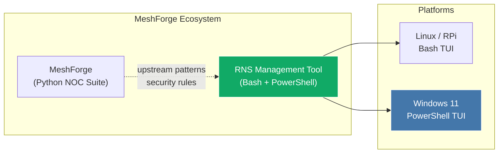
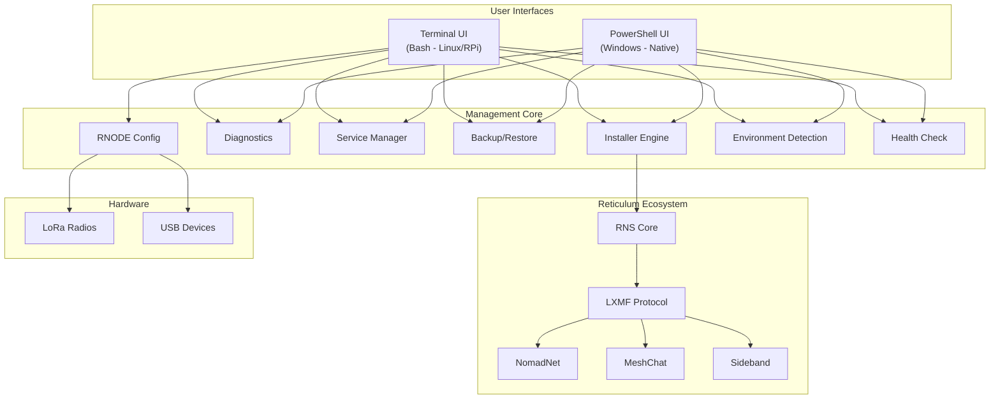
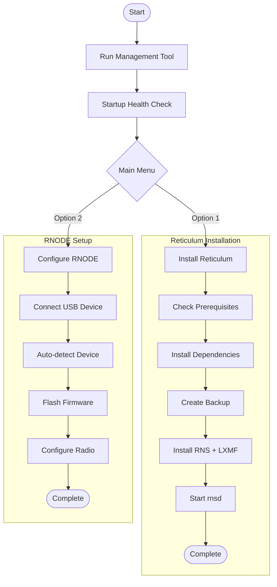
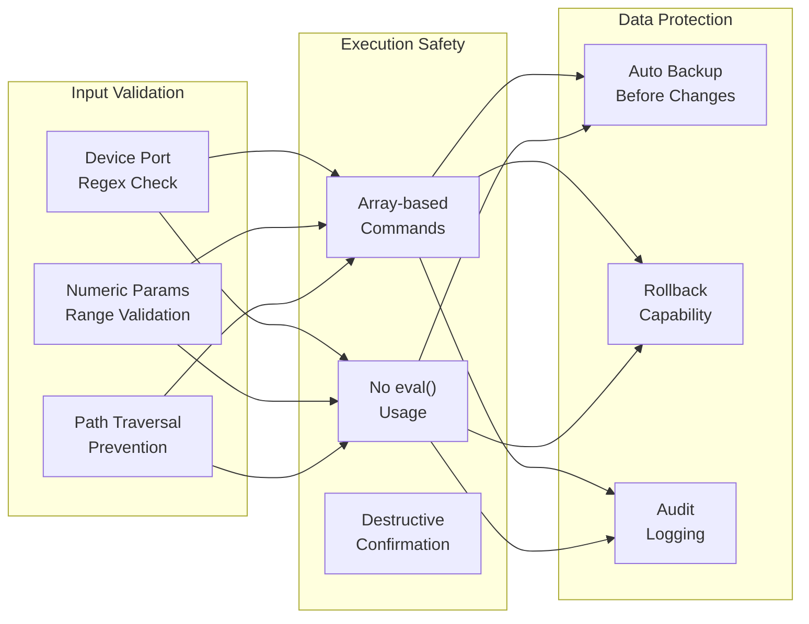

# RNS Management Tool

**Complete Reticulum Network Stack Management Solution**
*Part of the [MeshForge](https://github.com/Nursedude/meshforge) Ecosystem*

> [RNS installer](https://github.com/Nursedude/meshforge/blob/main/.claude/foundations/meshforge_ecosystem.md) for the [MeshForge ecosystem](https://github.com/Nursedude/meshforge/blob/main/.claude/foundations/meshforge_ecosystem.md)

A comprehensive, cross-platform management tool for the Reticulum ecosystem, featuring automated installation, configuration, and maintenance capabilities for Raspberry Pi, Linux, Windows 11, and WSL environments.

This is the **only MeshForge ecosystem tool with native Windows support**. Users don't need MeshForge installed to use this tool, but if they do, they can extend its functionality through MeshForge's gateway. Upstream MeshForge updates are frequent - environment patterns, security rules, and best practices flow downstream into this tool regularly.


> **Beta Software - Community Testing Needed**
>
> This tool is functional and actively developed, but has not been comprehensively field-tested across all supported platforms and hardware. If you use this tool, **please report issues and contribute improvements**. Your real-world testing on Raspberry Pi, desktop Linux, Windows, and with RNODE hardware is invaluable.
>
> Report issues: [GitHub Issues](https://github.com/Nursedude/RNS-Management-Tool/issues) | Contribute: [Pull Requests](https://github.com/Nursedude/RNS-Management-Tool/pulls)

---

## MeshForge Ecosystem



**Relationship to MeshForge:**
- MeshForge is the Python-based NOC reference suite for LoRa mesh networks
- RNS Management Tool extends the ecosystem with a shell-based TUI for Reticulum
- Security rules (RNS001-RNS006), environment patterns, and architectural decisions flow from MeshForge upstream
- This tool is standalone - no MeshForge installation required

---

## Architecture Overview



---

## Feature Matrix

| Category | Feature | Linux/RPi (Bash) | Windows (PowerShell) | Notes |
|----------|---------|:---:|:---:|-------|
| **Installation** | Full ecosystem install | ✅ | ✅ | |
| | Selective component updates | ✅ | ✅ | |
| | MeshChat with Node.js | ✅ | ❌ | Linux only (Node.js build) |
| **RNODE** | Auto-install firmware | ✅ | ⚠️ Basic | Windows: pip-only or WSL fallback |
| | Radio parameter config | ✅ | ❌ | Bash only (rnodeconf TUI) |
| | EEPROM management | ✅ | ❌ | Bash only |
| | 21+ board support | ✅ | ⚠️ via WSL | Full support through WSL bridge |
| **Services** | Start/Stop/Restart rnsd | ✅ | ✅ | |
| | Network tools (rncp, rnx, rnid) | ✅ | ✅ | |
| | Auto-start on boot | ✅ | ✅ | systemd / Task Scheduler |
| | meshtasticd integration | ✅ | ❌ | RPi/Linux only |
| **Backup** | Automatic timestamped | ✅ | ✅ | |
| | Export/Import archives | ✅ (.tar.gz) | ✅ (.zip) | Platform-native formats |
| | Factory reset | ✅ | ✅ | |
| **Diagnostics** | 6-step actionable diagnostics | ✅ | ✅ | With "Fix:" suggestions |
| | Environment detection | ✅ | ✅ | |
| | USB device detection | ✅ | ⚠️ | Windows: COM port detection |
| | Startup health check | ✅ | ✅ | Disk, memory, log validation |
| **Config** | Config templates (4 presets) | ✅ | ❌ | minimal, LoRa, TCP, transport |
| | Config editor from TUI | ✅ | ❌ | Launches $EDITOR with backup |
| | First-run wizard | ✅ | ❌ | Auto-detects fresh setup |
| **UI** | Quick Status Dashboard | ✅ | ✅ | |
| | Compact status line in header | ✅ | ❌ | Version, rnsd, tools, SSH, uptime |
| | Emergency quick mode | ✅ | ❌ | Field operations |
| | Progress indicators | ✅ | ✅ | |

---

## Quick Start

### Linux / Raspberry Pi

```bash
# Clone the repository
git clone https://github.com/Nursedude/RNS-Management-Tool.git
cd RNS-Management-Tool

# Make executable and run
chmod +x rns_management_tool.sh
./rns_management_tool.sh
```

### Windows 11

```powershell
# Clone the repository
git clone https://github.com/Nursedude/RNS-Management-Tool.git
cd RNS-Management-Tool

# Run the tool (you may need to allow script execution)
Set-ExecutionPolicy -Scope Process -ExecutionPolicy Bypass
.\rns_management_tool.ps1
```

### CI Validation Mode

```bash
# Validate without launching the TUI
./rns_management_tool.sh --check
```

---

## Usage Guide

### Main Menu

```
  --- Installation ---
   1) Install/Update Reticulum Ecosystem
   2) Install/Configure RNODE Device
   3) Install NomadNet
   4) Install MeshChat
   5) Install Sideband

  --- Management ---
   6) System Status & Diagnostics
   7) Manage Services
   8) Backup/Restore Configuration
   9) Advanced Options

  --- Quick & Help ---
   q) Quick Mode (field operations)
   h) Help & Quick Reference
   0) Exit
```

### Services Menu

```
  --- Daemon Control ---
   1) Start rnsd daemon
   2) Stop rnsd daemon
   3) Restart rnsd daemon
   4) View detailed status

  --- Network Tools ---
   5) View network statistics (rnstatus)
   6) View path table (rnpath)
   7) Probe destination (rnprobe)
   8) Transfer file (rncp)
   9) Remote command (rnx)

  --- Identity & Boot ---
  10) Identity management (rnid)
  11) Enable auto-start on boot
  12) Disable auto-start on boot
```

### RNODE Configuration

Supports 21+ boards including LilyGO T-Beam, Heltec LoRa32, RAK4631, and more. Features auto-install firmware, radio parameter config (freq/BW/SF/CR/TX power with validation), EEPROM management, and bootloader updates.

### First-Time Setup



---

## Requirements

### Linux / Raspberry Pi
- Raspberry Pi OS or Debian/Ubuntu-based system
- Python 3.7+
- 512MB+ RAM, 500MB+ free disk space
- Internet connection (for installation)

### Windows 11
- Windows 11 (21H2+)
- PowerShell 5.1+ or PowerShell Core 7+
- Python 3.7+ (will offer to install if missing)
- 500MB+ free disk space

### Optional
- Node.js 18+ (for MeshChat - Linux/RPi only)
- Git (for source installations)
- USB port (for RNODE devices)
- WSL2 (for full RNODE support on Windows)

---

## Security Model



| Rule | Requirement | Status |
|------|-------------|--------|
| RNS001 | Array-based command execution, never `eval` | Enforced |
| RNS002 | Device port validation (regex) | Enforced |
| RNS003 | Numeric range validation | Enforced |
| RNS004 | Path traversal prevention | Enforced |
| RNS005 | Confirmation for destructive actions | Enforced |
| RNS006 | Subprocess timeout protection | Enforced |

---

## Troubleshooting

| Problem | Solution |
|---------|----------|
| Permission denied | `chmod +x rns_management_tool.sh` |
| RNODE not detected | `sudo usermod -aG dialout $USER` then logout/login |
| rnsd won't start | Check `~/.reticulum/config` exists; run `rnsd --daemon` to create default |
| MeshChat build fails | Ensure Node.js 18+ installed (script auto-upgrades via NodeSource) |
| pip not found | `sudo apt install python3-pip` |
| Low disk space warning | Free up space; tool requires 500MB minimum |

### Getting Help

1. **Run diagnostics**: Select option 6 from main menu
2. **Check logs**: View through Advanced Options > View/Search Logs
3. **CI validation**: `./rns_management_tool.sh --check`
4. **Report issues**: https://github.com/Nursedude/RNS-Management-Tool/issues

---

## Supported Platforms

### Raspberry Pi
All models: Pi 1-5, Zero (all variants), 400, Compute Modules

### Linux
Raspberry Pi OS, Ubuntu 20.04+, Debian 10+, Linux Mint, Pop!_OS, any Debian-based distribution

### Windows
Windows 11 (21H2+), Windows 11 with WSL2, Windows Server 2022

### RNODE Devices (21+ Boards)
LilyGO (T-Beam, T-Deck, LoRa32, T3S3, T-Echo), Heltec (LoRa32 v2-v4, Wireless Stick, T114), RAK Wireless (RAK4631), SeeedStudio (XIAO ESP32S3), Homebrew (ATmega1284p, generic ESP32)

---

## Contributing

Contributions are welcome! This tool is in beta and benefits from real-world testing.

### Development Setup

```bash
git clone https://github.com/Nursedude/RNS-Management-Tool.git
cd RNS-Management-Tool

# Syntax and lint checks
bash -n rns_management_tool.sh
shellcheck -x -S warning rns_management_tool.sh
for f in lib/*.sh; do bash -n "$f"; done
for f in lib/*.sh; do shellcheck -x -S warning "$f"; done

# Test suites
./tests/smoke_test.sh --verbose        # 183 assertions
bats tests/rns_management_tool.bats    # 63 tests
bats tests/hardware_validation.bats    # 104 tests
bats tests/integration_tests.bats      # 107 tests

# CI dry-run
./rns_management_tool.sh --check
```

See [CLAUDE.md](CLAUDE.md) for the full development guide and [CHANGELOG.md](CHANGELOG.md) for version history.

---

## Learn More

### Reticulum Network Stack
- Official Manual: https://reticulum.network/manual/
- GitHub: https://github.com/markqvist/Reticulum

### RNODE Hardware
- Hardware Guide: https://reticulum.network/manual/hardware.html
- Firmware: https://github.com/markqvist/RNode_Firmware
- Web Flasher: https://github.com/liamcottle/rnode-flasher

### Applications
- NomadNet: https://github.com/markqvist/nomadnet
- MeshChat: https://github.com/liamcottle/reticulum-meshchat
- Sideband: https://unsigned.io/sideband/

### MeshForge Ecosystem
- MeshForge (upstream): https://github.com/Nursedude/meshforge

---

## License

This project is licensed under the MIT License - see the LICENSE file for details.

## Acknowledgments

- **Mark Qvist** - Creator of Reticulum Network Stack
- **Liam Cottle** - MeshChat and RNode Web Flasher
- **Reticulum Community** - Testing and feedback
- **MeshForge** - Upstream patterns, security rules, and architecture guidance

---

**Part of the [MeshForge](https://github.com/Nursedude/meshforge) Ecosystem**
*Made for the Reticulum community*
