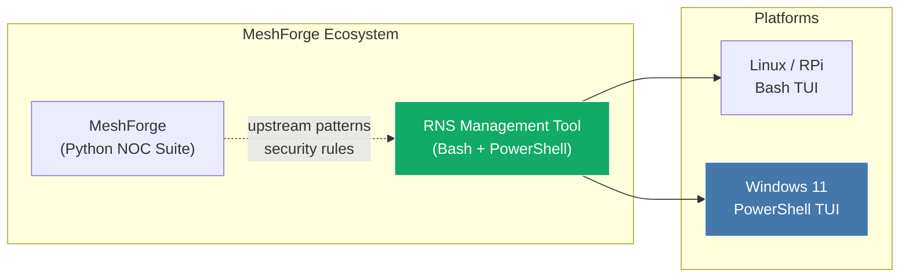
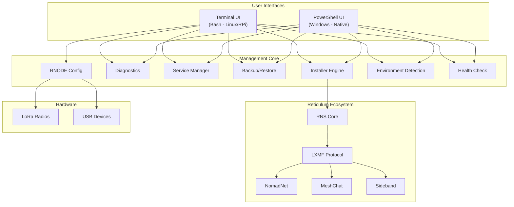

# RNS Management Tool

**Complete Reticulum Network Stack Management Solution**
*Part of the [MeshForge](https://github.com/Nursedude/meshforge) Ecosystem*

A comprehensive, cross-platform management tool for the Reticulum ecosystem, featuring automated installation, configuration, and maintenance capabilities for Raspberry Pi, Linux, Windows 11, and WSL environments.


> **Beta Software - Community Testing Welcome**
>
> This tool is functional and actively developed, but has **not been comprehensively field-tested** across all supported platforms and hardware combinations. Many features work in isolation but need real-world validation — especially RNODE hardware workflows, multi-device setups, and edge-case service management scenarios. If you use this tool, **please report issues and contribute improvements**. Your testing on Raspberry Pi, desktop Linux, Windows, and with RNODE hardware is invaluable.
>
> **What needs testing most:**
> - RNODE firmware flashing and radio configuration across all 21+ supported boards
> - MeshChat and Sideband installation on various Linux distributions
> - Windows PowerShell workflows (service management, backup/restore)
> - meshtasticd integration (HTTP API, SPI HAT detection)
> - Backup import/export across platforms
> - First-run wizard on fresh systems
>
> Report issues: [GitHub Issues](https://github.com/Nursedude/RNS-Management-Tool/issues) | Contribute: [Pull Requests](https://github.com/Nursedude/RNS-Management-Tool/pulls)

---

## Table of Contents

- [Installation](#installation)
- [Updating](#updating)
- [Usage Guide](#usage-guide)
- [MeshForge Integration](#meshforge-integration)
- [Feature Matrix](#feature-matrix)
- [Requirements](#requirements)
- [Architecture](#architecture)
- [Security Model](#security-model)
- [Troubleshooting](#troubleshooting)
- [Supported Platforms](#supported-platforms)
- [Contributing](#contributing)

---

## Installation

### Linux / Raspberry Pi

```bash
# Clone the repository
git clone https://github.com/Nursedude/RNS-Management-Tool.git
cd RNS-Management-Tool

# Make executable and run
chmod +x rns_management_tool.sh
./rns_management_tool.sh
```

On first launch, the tool will:
1. Run a startup health check (disk space, memory, port conflicts)
2. Detect your environment (Raspberry Pi model, OS, SSH session, Python version)
3. Launch the **first-run wizard** if no Reticulum configuration exists — guiding you through installing RNS, choosing a config template, and starting the daemon

**Prerequisites** (installed automatically if missing):
- Python 3.7+ and pip
- git, curl, wget
- build-essential (for compiled dependencies)

On Raspberry Pi, the tool also installs `python3-dev`, `libffi-dev`, and `libssl-dev`.

### Windows 11

```powershell
# Clone the repository
git clone https://github.com/Nursedude/RNS-Management-Tool.git
cd RNS-Management-Tool

# Run the tool (you may need to allow script execution)
Set-ExecutionPolicy -Scope Process -ExecutionPolicy Bypass
.\rns_management_tool.ps1
```

The PowerShell interface covers installation, service management, backup/restore, and diagnostics. For full RNODE hardware support on Windows, use WSL2.

### CI / Headless Validation

```bash
# Validate syntax, modules, and security rules without launching the TUI
./rns_management_tool.sh --check
```

---

## Updating

### Update the management tool itself

```bash
cd RNS-Management-Tool
git pull origin main
```

### Update Reticulum and ecosystem components

From the main menu, select **1) Install/Update Reticulum Ecosystem**. This will:
- Back up your current configuration automatically
- Stop the rnsd daemon
- Install/upgrade RNS, LXMF, and optionally NomadNet via pip
- Verify each component's installation with an import check
- Restart the daemon

You can also update individual components:
- **3) Install NomadNet** — updates NomadNet to the latest version
- **4) Install MeshChat** — pulls the latest from git and rebuilds
- **5) Install Sideband** — updates via pip or from source
- **9) Advanced Options > 4) Update System Packages** — runs `apt update && apt upgrade`

### Update RNODE firmware

Select **2) Install/Configure RNODE Device > Auto-install firmware** to flash the latest firmware to a connected RNODE device.

---

## Usage Guide

### Main Menu

```
  --- Installation ---
   1) Install/Update Reticulum Ecosystem
   2) Install/Configure RNODE Device
   3) Install NomadNet
   4) Install MeshChat
   5) Install Sideband

  --- Management ---
   6) System Status & Diagnostics
   7) Manage Services
   8) Backup/Restore Configuration
   9) Advanced Options

  --- Quick & Help ---
   q) Quick Mode (field operations)
   h) Help & Quick Reference
   0) Exit
```

### Quick Mode

Accessible from the main menu with `q`, Quick Mode provides rapid access to the most common field operations without navigating submenus:

```
   1) Start rnsd daemon
   2) Stop rnsd daemon
   3) Network status (rnstatus)
   4) Path table (rnpath -t)
   5) Probe destination
   6) Send file (rncp)
   7) Restart rnsd daemon
   8) View recent log (last 20 lines)
   9) View interfaces
```

### Services Menu

```
  --- rnsd Daemon Control ---
   1) Start rnsd daemon
   2) Stop rnsd daemon
   3) Restart rnsd daemon
   4) View detailed status

  --- meshtasticd Control --- (shown when meshtasticd is installed)
  m1) Start meshtasticd
  m2) Stop meshtasticd
  m3) Restart meshtasticd
  m4) Check HTTP API & config

  --- Network Tools ---
   5) View network statistics (rnstatus)
   6) View path table (rnpath)
   7) Probe destination (rnprobe)
   8) Transfer file (rncp)
   9) Remote command (rnx)

  --- Identity & Boot ---
  10) Identity management (rnid)
  11) Enable auto-start on boot
  12) Disable auto-start on boot
```

### RNODE Configuration

Supports 21+ boards including LilyGO T-Beam, Heltec LoRa32, RAK4631, and more. Features auto-install firmware, radio parameter config (frequency, bandwidth, spreading factor, coding rate, TX power — all with bounds validation), EEPROM management, and bootloader updates.

### Configuration Templates

Four pre-built configurations for common setups:

| Template | Use Case |
|----------|----------|
| `minimal.conf` | Local network only — AutoInterface peer discovery on LAN |
| `tcp_client.conf` | Internet connectivity via community transport nodes |
| `lora_rnode.conf` | LoRa radio communication with an RNODE device |
| `transport_node.conf` | Full routing node — forwards traffic for the network |

Apply templates through **9) Advanced Options > 3) Apply Configuration Template** or during the first-run wizard.

### Advanced Options

```
  --- Configuration ---
   1) View Configuration Files      (paginated output)
   2) Edit Configuration File       (launches $EDITOR with auto-backup)
   3) Apply Configuration Template
   d) Apply Deployment Profile       (Relay / Mobile / Base Station)

  --- Maintenance ---
   4) Update System Packages
   5) Reinstall All Components
   6) Clean Cache and Temporary Files
   7) View/Search Logs               (paginated, with keyword search)
   8) Reset to Factory Defaults      (requires typing RESET, auto-backup first)
```

---

## MeshForge Integration


```mermaid
graph LR
    subgraph "MeshForge Ecosystem"
        MF["MeshForge<br/>(Python NOC Suite)"]
        RNS_TOOL["RNS Management Tool<br/>(Bash + PowerShell)"]
    end

    subgraph "Platforms"
        LINUX["Linux / RPi<br/>Bash TUI"]
        WINDOWS["Windows 11<br/>PowerShell TUI"]
    end

    MF -.->|"upstream patterns<br/>security rules"| RNS_TOOL
    RNS_TOOL --> LINUX
    RNS_TOOL --> WINDOWS

    style RNS_TOOL fill:#1a6,stroke:#fff,color:#fff
    style WINDOWS fill:#47a,stroke:#fff,color:#fff
```

**This tool works standalone** — no MeshForge installation required. However, it is designed to complement MeshForge for users running both:

- **MeshForge** is the Python-based NOC reference suite for LoRa mesh networks (Meshtastic + RNS gateway, node tracking, maps, diagnostics dashboard)
- **RNS Management Tool** provides a lightweight shell-based TUI focused specifically on Reticulum ecosystem management
- Security rules (RNS001-RNS010), TUI patterns, service management approaches, and reliability practices flow from MeshForge upstream
- If you run MeshForge's gateway alongside RNS, this tool manages the Reticulum side while MeshForge handles the Meshtastic bridge

**Using both together:**
1. Install MeshForge for gateway/NOC features: https://github.com/Nursedude/meshforge
2. Use RNS Management Tool for Reticulum-specific tasks (installing RNS/LXMF/NomadNet, configuring RNODE devices, managing rnsd, backups)
3. Both tools share the same `~/.reticulum/config` and service state

This is the **only MeshForge ecosystem tool with native Windows support**.

---

## Feature Matrix

| Category | Feature | Linux/RPi (Bash) | Windows (PowerShell) | Notes |
|----------|---------|:---:|:---:|-------|
| **Installation** | Full ecosystem install | ✅ | ✅ | With progress spinner |
| | Selective component updates | ✅ | ✅ | |
| | MeshChat with Node.js | ✅ | ❌ | Linux only (Node.js build) |
| | First-run wizard | ✅ | ❌ | Auto-detects fresh setup |
| **RNODE** | Auto-install firmware | ✅ | ⚠️ Basic | Windows: pip-only or WSL fallback |
| | Radio parameter config | ✅ | ❌ | Bash only (rnodeconf TUI) |
| | EEPROM management | ✅ | ❌ | Bash only |
| | 21+ board support | ✅ | ⚠️ via WSL | Full support through WSL bridge |
| **Services** | Start/Stop/Restart rnsd | ✅ | ✅ | |
| | Network tools (rncp, rnx, rnid) | ✅ | ✅ | |
| | Auto-start on boot | ✅ | ✅ | systemd / Task Scheduler |
| | meshtasticd integration | ✅ | ❌ | RPi/Linux only |
| | Port conflict resolution | ✅ | ❌ | Detects + offers to fix at startup |
| **Backup** | Automatic timestamped | ✅ | ✅ | |
| | Export/Import archives | ✅ (.tar.gz) | ✅ (.zip) | Platform-native formats |
| | Factory reset | ✅ | ✅ | Auto-backup before reset |
| **Diagnostics** | 6-step actionable diagnostics | ✅ | ✅ | With "Fix:" suggestions |
| | Environment detection | ✅ | ✅ | |
| | USB device detection | ✅ | ⚠️ | Windows: COM port detection |
| | Startup health check | ✅ | ✅ | Disk, memory, ports, log validation |
| **Config** | Config templates (4 presets) | ✅ | ❌ | minimal, LoRa, TCP, transport |
| | Deployment profiles | ✅ | ❌ | Relay, Mobile, Base Station |
| | Config editor from TUI | ✅ | ❌ | Launches $EDITOR with backup |
| **UI** | Quick Status Dashboard | ✅ | ✅ | |
| | Compact status line in header | ✅ | ❌ | Version, rnsd, tools, SSH, uptime |
| | Quick Mode (field ops) | ✅ | ❌ | 9 rapid actions |
| | Progress spinner | ✅ | ✅ | Animated during installs |
| | Output pagination | ✅ | ❌ | Page-by-page for long output |
| | Menu idle timeout | ✅ | ❌ | Exits after 1hr idle (SSH safety) |

---

## Requirements

### Linux / Raspberry Pi
- Raspberry Pi OS or Debian/Ubuntu-based system
- Python 3.7+
- 512MB+ RAM, 500MB+ free disk space
- Internet connection (for installation)

### Windows 11
- Windows 11 (21H2+)
- PowerShell 5.1+ or PowerShell Core 7+
- Python 3.7+ (will offer to install if missing)
- 500MB+ free disk space

### Optional
- Node.js 18+ (for MeshChat — Linux/RPi only, auto-installed if needed)
- Git (for source installations — auto-installed if needed)
- USB port (for RNODE devices)
- WSL2 (for full RNODE support on Windows)

---

## Architecture


```mermaid
graph TB
    subgraph "User Interfaces"
        TUI["Terminal UI<br/>(Bash - Linux/RPi)"]
        PS["PowerShell UI<br/>(Windows - Native)"]
    end

    subgraph "Management Core"
        INST[Installer Engine]
        DIAG[Diagnostics]
        SVC[Service Manager]
        BACKUP[Backup/Restore]
        RNODE[RNODE Config]
        ENV[Environment Detection]
        HEALTH[Health Check]
    end

    subgraph "Reticulum Ecosystem"
        RNS[RNS Core]
        LXMF[LXMF Protocol]
        NOMAD[NomadNet]
        MESH[MeshChat]
        SIDE[Sideband]
    end

    subgraph "Hardware"
        LORA[LoRa Radios]
        USB[USB Devices]
    end

    TUI --> INST & DIAG & SVC & BACKUP & RNODE & ENV & HEALTH
    PS --> INST & DIAG & SVC & BACKUP & ENV & HEALTH

    INST --> RNS --> LXMF
    LXMF --> NOMAD & MESH & SIDE
    RNODE --> LORA & USB
```

### Project Structure

```
RNS-Management-Tool/
├── rns_management_tool.sh          # Main Bash dispatcher
├── rns_management_tool.ps1         # Windows PowerShell dispatcher
├── lib/                            # Bash modules (11 files, ~5,800 lines)
│   ├── core.sh                     # Terminal detection, colors, globals
│   ├── validation.sh               # Input validation (RNS002-RNS004)
│   ├── utils.sh                    # Timeout, retry, spinner, logging, service checks
│   ├── ui.sh                       # Menus, box drawing, pagination, status line
│   ├── install.sh                  # Prerequisites, ecosystem, MeshChat, Sideband
│   ├── rnode.sh                    # RNODE device configuration (21+ boards)
│   ├── services.sh                 # rnsd/meshtasticd management, network tools
│   ├── backup.sh                   # Backup/restore, export/import
│   ├── diagnostics.sh              # 6-step diagnostics with return codes
│   ├── config.sh                   # Config templates, editor, log viewer
│   └── advanced.sh                 # Quick mode, advanced menu, first-run wizard
├── pwsh/                           # PowerShell modules (9 files, ~2,560 lines)
├── config_templates/               # Pre-built RNS configurations (4 templates)
├── tests/                          # Test suites (~6,100 lines, 990+ assertions)
├── scripts/                        # lint.sh, dead_code_check.sh, verify_install.sh
└── .githooks/                      # Pre-commit hook (syntax + linter)
```

---

## Security Model

| Rule | Requirement | Status |
|------|-------------|--------|
| RNS001 | Array-based command execution, never `eval` | Enforced |
| RNS002 | Device port validation (regex) | Enforced |
| RNS003 | Numeric range validation | Enforced |
| RNS004 | Path traversal prevention | Enforced |
| RNS005 | Confirmation for destructive actions | Enforced |
| RNS006 | Subprocess timeout protection | Enforced |
| RNS009 | Temp files must use `mktemp` | Enforced |
| RNS010 | No sensitive data in log output | Enforced |

A formal security and code review was completed on 2026-02-21, rating the project **A** with no critical vulnerabilities. See [SECURITY_REVIEW.md](SECURITY_REVIEW.md) for the full audit report.

---

## Troubleshooting

| Problem | Solution |
|---------|----------|
| Permission denied | `chmod +x rns_management_tool.sh` |
| RNODE not detected | `sudo usermod -aG dialout $USER` then logout/login |
| rnsd won't start | Check `~/.reticulum/config` exists; run `rnsd --daemon` to create default |
| Port 37428 in use | Tool detects this at startup and offers to stop the blocking process |
| MeshChat build fails | Ensure Node.js 18+ installed (script auto-upgrades via NodeSource) |
| pip not found | `sudo apt install python3-pip` |
| pip externally-managed error | Debian 12+ / RPi OS Bookworm; tool auto-adds `--break-system-packages` |
| Low disk space warning | Free up space; tool requires 500MB minimum |
| Session hangs on SSH | Menus auto-timeout after 1 hour of inactivity |

### Getting Help

1. **Run diagnostics**: Select option 6 from main menu
2. **Check logs**: View through Advanced Options > View/Search Logs (paginated output with keyword search)
3. **Quick Mode**: Press `q` from the main menu for rapid field operations
4. **CI validation**: `./rns_management_tool.sh --check`
5. **Report issues**: https://github.com/Nursedude/RNS-Management-Tool/issues

---

## Supported Platforms

### Raspberry Pi
All models: Pi 1-5, Zero (all variants), 400, Compute Modules

### Linux
Raspberry Pi OS, Ubuntu 20.04+, Debian 10+, Linux Mint, Pop!_OS, any Debian-based distribution

### Windows
Windows 11 (21H2+), Windows 11 with WSL2, Windows Server 2022

### RNODE Devices (21+ Boards)
LilyGO (T-Beam, T-Deck, LoRa32, T3S3, T-Echo), Heltec (LoRa32 v2-v4, Wireless Stick, T114), RAK Wireless (RAK4631), SeeedStudio (XIAO ESP32S3), Homebrew (ATmega1284p, generic ESP32)

---

## Contributing

Contributions are welcome! This tool is in beta and benefits greatly from real-world testing.

### Development Setup

```bash
git clone https://github.com/Nursedude/RNS-Management-Tool.git
cd RNS-Management-Tool

# Enable pre-commit hooks (enforces syntax + linter on every commit)
git config core.hooksPath .githooks

# Syntax validation
bash -n rns_management_tool.sh
for f in lib/*.sh; do bash -n "$f"; done

# ShellCheck linting
shellcheck -x -S warning rns_management_tool.sh
for f in lib/*.sh; do shellcheck -x -S warning "$f"; done

# Custom linter (RNS001-RNS010)
./scripts/lint.sh

# Test suites
./tests/smoke_test.sh --verbose         # 171+ assertions
bats tests/rns_management_tool.bats     # 63 tests
bats tests/hardware_validation.bats     # 92 tests
bats tests/integration_tests.bats       # 143 tests
bats tests/regression_guards.bats       # 72 tests
bats tests/functional_tests.bats        # 59 tests
bats tests/service_health_tests.bats    # 24 tests
bats tests/diagnostics_enhanced.bats    # 15 tests

# Or use the lightweight BATS-compatible runner (no bats-core required)
bash tests/run_bats_compat.sh tests/functional_tests.bats

# CI dry-run
./rns_management_tool.sh --check

# Post-install verification
./scripts/verify_install.sh             # Colored output
./scripts/verify_install.sh --json      # Machine-readable
```

### Testing Status

The test suite covers structural patterns, functional behavior, security rules, service health classification, and regression guards. However, many features need **real hardware and real-world validation**:

- **Well-tested** (automated): Syntax, security rules, input validation, service health state classification, backup/restore logic, config template handling, menu structure
- **Needs field testing**: RNODE firmware flashing, radio parameter configuration, MeshChat/Sideband install on varied distros, meshtasticd HTTP API integration, Windows PowerShell workflows, export/import across platforms

If you can test on hardware or platforms the maintainers don't have access to, that's the most valuable contribution.

### Commit Message Format

```
<type>(<scope>): <description>

Types: feat, fix, docs, style, refactor, test, chore
Scope: bash, powershell, docs, rnode, service, backup
```

See [CLAUDE.md](CLAUDE.md) for the full development guide and [CHANGELOG.md](CHANGELOG.md) for version history.

---

## Learn More

### Reticulum Network Stack
- Official Manual: https://reticulum.network/manual/
- GitHub: https://github.com/markqvist/Reticulum

### RNODE Hardware
- Hardware Guide: https://reticulum.network/manual/hardware.html
- Firmware: https://github.com/markqvist/RNode_Firmware
- Web Flasher: https://github.com/liamcottle/rnode-flasher

### Applications
- NomadNet: https://github.com/markqvist/nomadnet
- MeshChat: https://github.com/liamcottle/reticulum-meshchat
- Sideband: https://unsigned.io/sideband/

### MeshForge Ecosystem
- MeshForge (upstream): https://github.com/Nursedude/meshforge

---

## License

This project is licensed under the GNU General Public License v3.0 - see the [LICENSE](LICENSE) file for details.

## Acknowledgments

- **Mark Qvist** - Creator of Reticulum Network Stack
- **Liam Cottle** - MeshChat and RNode Web Flasher
- **Reticulum Community** - Testing and feedback
- **MeshForge** - Upstream patterns, security rules, and architecture guidance

---

**Part of the [MeshForge](https://github.com/Nursedude/meshforge) Ecosystem**
*Made for the Reticulum community*
